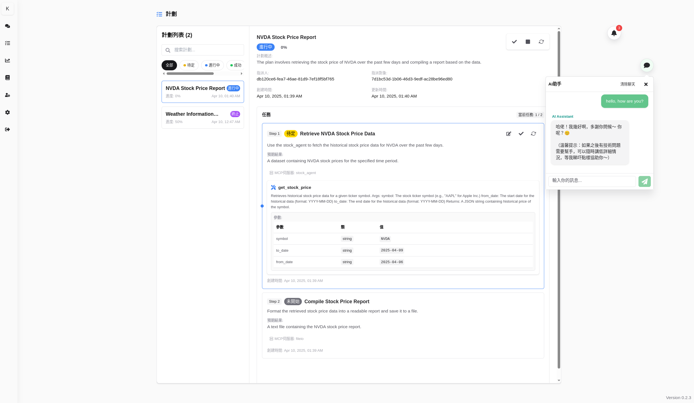

# onlysaid

onlysaid (光說不做) is a go-to chatroom application for you to collaborate with your team and AI agents, integrated with planning system, knowledge base, and MCP protocols.
onlysaid is under rapid development, welcome to contribute.



## Features

- All-in-one MCP stack with easy-to-use client & servers
- Intelligent planning system based on chatroom's context
- Planning management with MCP tool executions
- Global AI assistant with a growing knowledge base integrated.
- Support multiple languages, Chinese, English, Japanese, Korean, and more to come.
- OpenAI/ Deepseek supported

## Setup

```bash
cp config/.env.template config/.env
docker compose up


# openai llm
OPENAI_API_KEY=<YOUR-API-Key>
OPENAI_API_BASE_URL=https://api.deepseek.com
OPENAI_MODEL=deepseek-chat

# embedding
docker exec -it onlysaid-ollama bash
ollama pull nomic-embed-text
```

Visit `onlysaid-dev.com` to open the web application.
